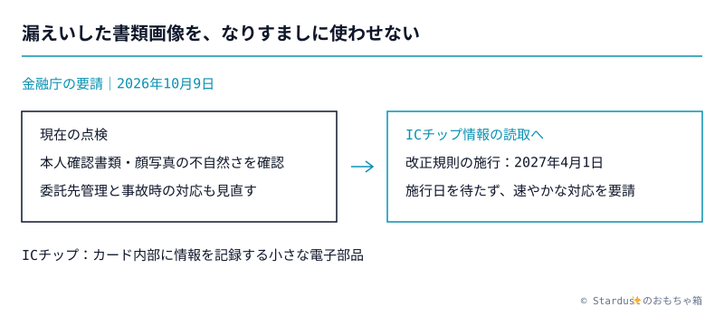
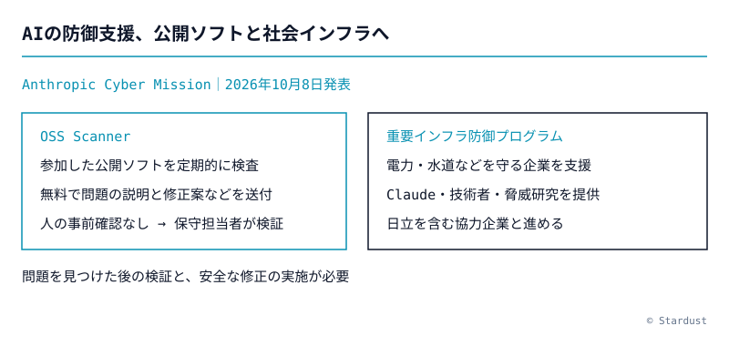
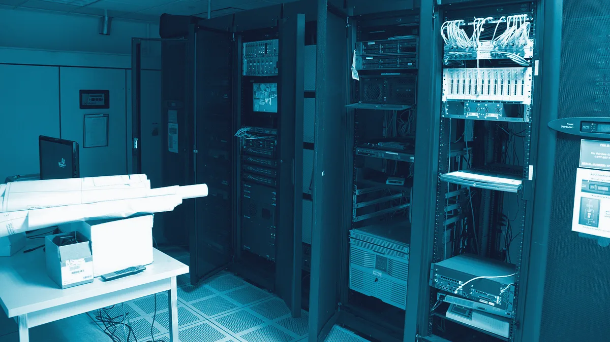
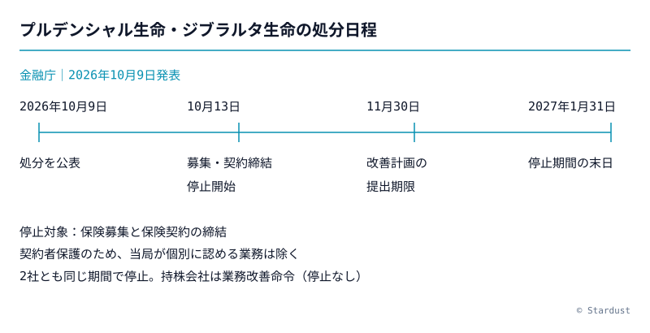

<section class="desk">

## トップ

<section class="story">

### 漏れた身分証画像の悪用を防ぐ、金融庁が本人確認の切替を要請

*図: 星屑新報（金融庁「現下の情勢を踏まえたサイバーセキュリティ対策の強化と各種取引申込等における対応について」から作成）/ © Stardust*

金融庁は10月9日、本人確認書類の画像を含む情報漏えいを受け、金融機関等に対策の点検を求めた。オンラインでの本人確認では、書類や顔写真の不自然な点を改めて確認するよう要請した。2027年4月1日から原則となるICチップ（カード内部に情報を記録する電子部品）の読取にも、施行を待たず移るよう求めている。

**なぜ大事か**: 情報を盗まれる被害に加え、その画像で他人に口座を作られる二次被害を防ぐ必要がある。

出典: [金融庁](https://www.fsa.go.jp/news/r8/sonota/20261009/20261009.html)、[CoinPost](https://coinpost.jp/?p=742056)

</section>

</section>

<section class="desk">

## Crypto

<section class="story">

### Celsius元CEO、金融業界への復帰を恒久的に禁じる和解

ニューヨーク州司法長官は10月9日、暗号資産を預かり利回りをうたったCelsiusの元CEO、Alex Mashinsky氏との和解を発表した。証券・商品・暗号資産業界での事業参加を恒久的に禁じる。州への支払額は最大3500万ドルだが、連邦政府への追加没収や刑期の履行に関する条件付きで、全額の支払いが確定したわけではない。

**なぜ大事か**: 高い利回りの説明だけでなく、預けた資産の運用方法や事業者への監督を確かめる意味がある。

出典: [ニューヨーク州司法長官](https://ag.ny.gov/press-release/2026/attorney-general-james-bans-former-cryptocurrency-ceo-who-defrauded-investors)、[CoinDesk](https://www.coindesk.com/policy/2026/10/09/new-york-ag-secures-up-to-usd35-million-and-lifetime-crypto-ban-from-celsius-alex-mashinsky)、[The Block](https://www.theblock.co/news/regulation/2026-10-09-ny-attorney-general-alex-mashinsky-celsius-35-million-ban-418154)

</section>

</section>

<section class="desk">

## AI

<section class="story">

### 公開ソフトを無料検査、Anthropicがインフラ防御も支援

*図: 星屑新報（Anthropic「Introducing the Anthropic Cyber Mission」から作成）/ © Stardust*

Anthropicは10月8日、サイバー防御を支える長期的な取り組みを発表した。OSS、つまりソースコードが公開されたソフト向けに、希望するプロジェクトを無料で定期検査する「OSS Scanner」を始めるが、報告には人の事前確認がなく、誤りの検証が必要だ。電力や水道などの重要インフラを守る企業への支援も始め、日立が協力企業に加わった。

**なぜ大事か**: AIが弱点を探す速さを上げても、保守担当者が確かめて安全に直す体制が欠かせない。

出典: [Anthropic](https://www.anthropic.com/news/anthropic-cyber-mission)、[ITmedia](https://www.itmedia.co.jp/news/article/2610/09/2000002164/)、[NHK](https://news.web.nhk/newsweb/na/nd-20261009de57120)

</section>

<section class="story">

### Claudeを機械につなぐ場合、人が止められることを条件に

Anthropicは10月8日に利用方針の改定を公表し、11月12日から適用する。けがを起こし得る機械をClaudeが自律的に動かす場合、適切な担当者が監視・停止でき、接続が切れても安全な状態を保てることを求める。健康や財産などに関わる重要な用途では、人が判断を見直せることと、AI利用を当事者に知らせる従来の要件も明確にした。

**なぜ大事か**: AIへの作業委任が広がるほど、誤判断を現実の被害に変えない仕組みが必要になる。

出典: [Anthropic](https://www.anthropic.com/news/2026-usage-policy-update)

</section>

</section>

<section class="desk">

## セキュリティ

<section class="story">

### 国内の漏えい、管理システムと内部への侵入も点検対象に

*画像: 「Server Room」Carl Lender（[Flickr](https://www.flickr.com/photos/clender/22397102849/)）・Wikimedia Commons / [CC BY 2.0](https://creativecommons.org/licenses/by/2.0/)（https://commons.wikimedia.org/wiki/File:Server_Room_%2822397102849%29.jpg）（加工: 星屑新報）*

JPCERT/CCは10月9日、国内で相次ぐ不正アクセスへの注意喚起を更新した。公開Webサーバーから接続できる別のサーバーに、攻撃者が遠隔操作するための「Webシェル」を置く事例を追加した。従業員向けの管理システムも含め、不要な外部公開の停止、更新の適用、侵入後に別の機器へ被害を広げさせない対策を求めている。

**なぜ大事か**: 表のサービスだけを守っても、裏側の管理機能から大量の情報を盗まれるおそれがある。

出典: [JPCERT/CC](https://www.jpcert.or.jp/at/2026/at260030.html)

</section>

<section class="story">

### NetScalerに遠隔操作のおそれ、認証の設定を確かめ更新を

Citrixは10月8日、通信や外部からの接続を管理するNetScaler ADCとGatewayの深刻な弱点「CVE-2026-107406」を公表した。ログイン情報をサービス間で受け渡すSAMLの機能を使う設定では、遠隔からプログラムを実行されたり、サービスを止められたりするおそれがある。Citrixは利用者に、14.1-73.46以降や13.1-64.29以降などの修正版へ早急に更新するよう強く求めている。

**なぜ大事か**: 接続の入口を担う機器の弱点は、組織全体への侵入や業務停止につながり得る。

出典: [Citrix公式告知CTX697191](https://support.citrix.com/external/article/CTX697191/citrix-netscaler-adc-and-citrix-netscale.html)

</section>

<section class="story">

### FBIなどがFlax Typhoonの攻撃用サービスへのアクセスを遮断

米司法省とFBI（連邦捜査局）は10月8日、裁判所の許可を得てドメインを差し押さえ、攻撃用の「Microscan」と「FishHub」へのアクセスを遮断したと発表した。司法省によると、中国政府と契約を持つ企業Integrity Technology Groupに関係する攻撃グループFlax Typhoonが、米国や海外の重要インフラなどを狙って使っていた。Microscanはネットワークの弱点を探し、FishHubは相手に合わせた偽メールで侵入を助ける道具で、日本の空港も弱点探しの標的に含まれた。

**なぜ大事か**: 攻撃を支えるサービスを止める取り組みとともに、各組織でも公表された侵入の痕跡を点検する必要がある。

出典: [米司法省](https://www.justice.gov/opa/pr/justice-department-and-fbi-seize-vulnerability-scanning-and-spear-phishing-tools-operated)

</section>

</section>

<section class="desk">

## 日本の社会と経済

<section class="story">

### プルデンシャル生命とジブラルタ生命、募集と契約締結を来年1月末まで停止へ

*図: 星屑新報（金融庁「プルデンシャル生命保険株式会社、ジブラルタ生命保険株式会社及びプルデンシャル・ホールディング・オブ・ジャパン株式会社に対する行政処分について」から作成）/ © Stardust*

金融庁は10月9日、プルデンシャル生命とジブラルタ生命に、10月13日から2027年1月31日まで保険募集と契約締結の停止を命じた。契約者保護のため当局が個別に認める業務は除き、両社と持株会社には11月30日までの改善計画の提出も求めた。営業職員による金銭の不適切な扱いや、営業を優先して管理を怠った経営体制を問題とし、持株会社には子会社の監督を強めるよう業務改善を命じた。

**なぜ大事か**: 契約者の保護を、担当者個人だけでなく報酬制度や経営の監督から立て直す処分だ。

出典: [金融庁](https://www.fsa.go.jp/news/r8/hoken/20261009/20261009.html)、[NHK](https://news.web.nhk/newsweb/na/nd-20261009de57195)

</section>

<section class="story">

### 食料品の消費税を2年間1%へ、政府が法案を国会に提出

政府は10月9日、飲食料品の消費税を一時的に下げる法案を閣議決定し、国会に提出した。2027年4月から2年間、税率を8%から1%に下げ、中・低所得の働く人の負担を軽くする支援金も組み合わせる内容だ。まだ成立した法律ではなく、政府は減税などの財源を赤字国債に頼らず確保し、具体策を今後の予算編成で示すとしている。

**なぜ大事か**: 毎日の買い物に関わる減税案で、家計への効果と財源の確保を国会で確かめる段階に入った。

出典: [首相官邸・10月9日閣議案件](https://www.kantei.go.jp/jp/kakugi/2026/kakugi-2026100901.html)、[財務省・10月9日会見](https://www.mof.go.jp/public_relations/conference/my20261009.html)、[内閣官房・国会提出法案](https://www.cas.go.jp/jp/houan/222.html)

</section>

</section>

<section class="desk">

## 今日の選び方

材料は直近24時間のRSS206件。重複をまとめ、公式本文で確認できた9本を選んだ。10月10日の補足調査で減税法案、NetScalerの弱点、Flax Typhoonの攻撃用サービスの遮断を追加し、10月8日の公式発表も対象にした。  
価格の上下、宣伝、細かな更新、調査中のLedgerの流出額、国家公務員の給与改定は見送った。Flax Typhoonの差押えドメインの総数は、一次情報に無いため記載しなかった。  
画像は説明用の写真1枚と自作SVG3枚。写真はCommons APIで作者とCC BY 2.0を確認し、図は各公式発表をもとに作成した。

</section>
