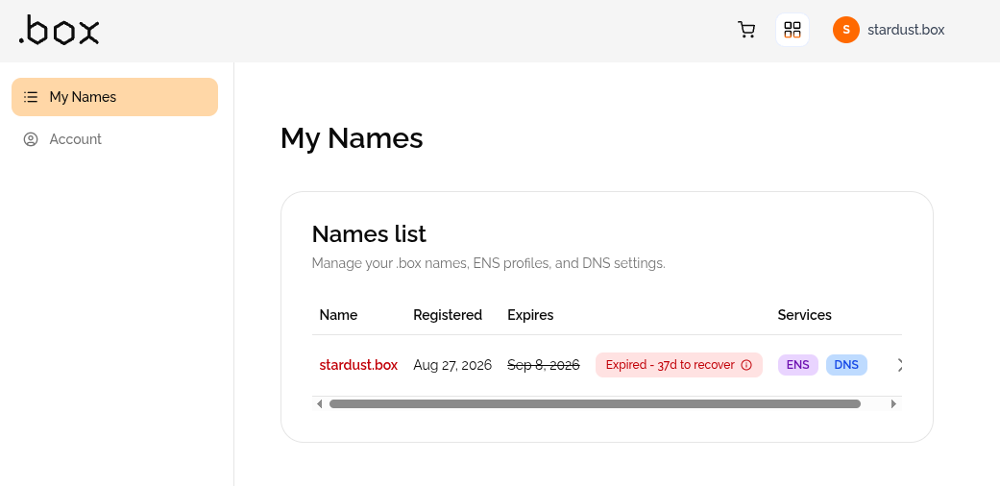
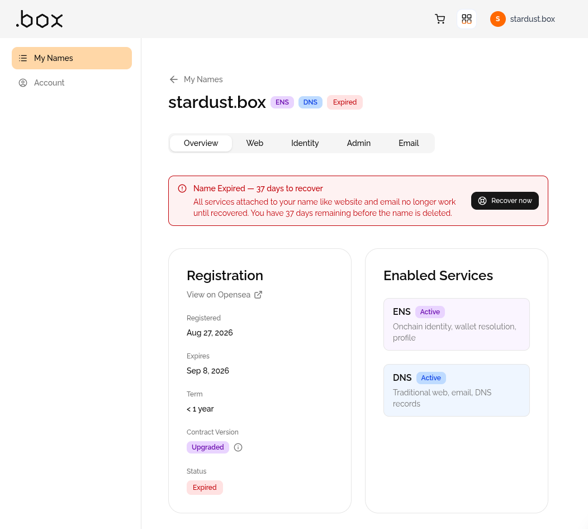
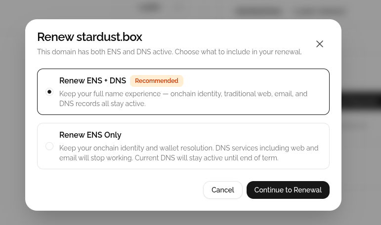
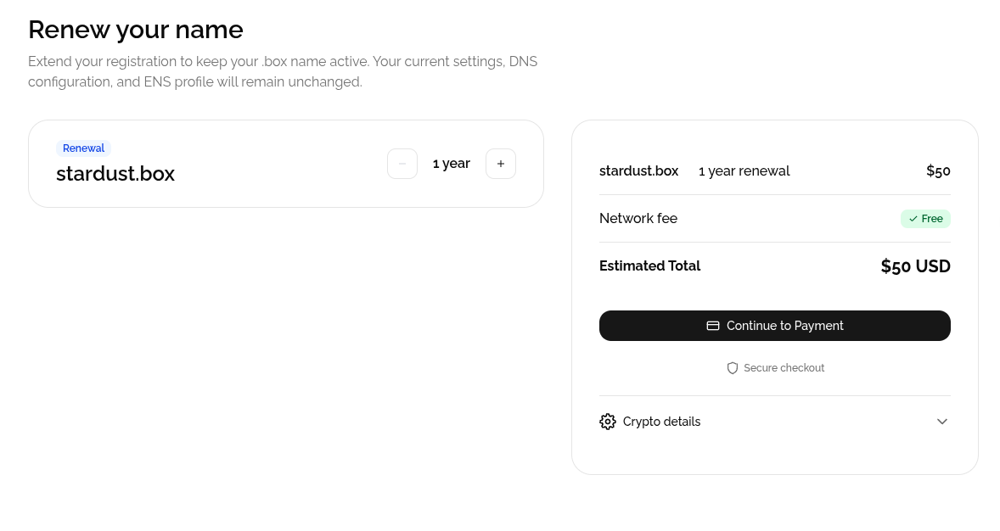
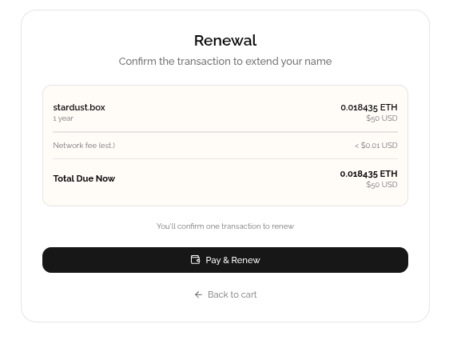
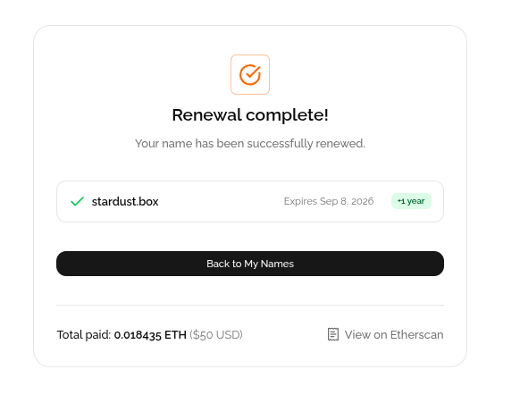

旧サイトで使っていた `stardust.box` の期限が切れていた。気づいたのは、新しいサイトの置き場所を考えはじめたときだった。

## `.box` は「ENS と DNS がひとつになった」ドメイン

`.box` は、ふつうのドメインとは少し違う。[my.box](https://my.box/) で買うと、ひとつの名前が 2 つの顔を持つ。

- **ENS 互換のオンチェーンの名前**: ウォレットで持つ。`0x...` の長いアドレスの代わりに `stardust.box` で送金先を指定できる
- **ふつうの DNS のドメイン**: Web サイトやメールに使える

持ち主の確認はウォレットで行う。アカウントの登録も本人確認（KYC）もいらない。

以前は 3DNS という会社が運営していて、名前は Optimism 上の NFT として発行されていた。いまの my.box の説明は「ENS 互換の名前」になっていて、仕組みが変わったようだ。

## 期限切れの状態

ドメインの登録情報（RDAP）を調べると、こうなっていた。

- ステータスは `auto renew period`（期限のあと、元の持ち主だけが取り戻せる猶予期間）
- ネームサーバーは駐車場ページ用のものに切り替わっていた
- 一方で、ENS の名前はまだ自分のウォレットを指していた

つまり「オンチェーンの名前はまだ手元にあるが、DNS のほうは止まっている」状態。

my.box にウォレットを接続すると、はっきり書かれていた。

**あと 37 日で削除される。** 期限から数えると 64 日目で、以前 3DNS が説明していた猶予期間とちょうど一致する。

「サイトやメールなど、名前につながるサービスは、取り戻すまで動かない」とある。削除されたあとは誰でも取れるようになり、最初の数日はオークションになる。

## 取り戻す

「Recover now」を押すと、何を更新するかを選ぶ画面になる。

「ENS だけ」を選ぶと、オンチェーンの名前は残るが、DNS（Web・メール）は期限で止まる。サイトに使いたいので「ENS + DNS」にした。

1 年で 50 ドル。支払いはクレジットカードのほか、Ethereum 上の ETH・USDC・USDT が選べる。ETH で払った。

0.018435 ETH で完了。ネームサーバーも、駐車場用からふつうのものに戻った。

## つまずいたところ

### ウォレットにつながらず、QR コードが出た

「Connect wallet」を押すと、スマホの MetaMask で読み取るための QR コードが出た。ブラウザには MetaMask の拡張機能を入れたばかりだった。

原因は、**MetaMask を入れる前から開いていたタブ**だったこと。拡張機能は、ページを開いたときに「ここにいる」とページに知らせる。古いタブはそれを知らない。ページを再読み込みしたら、そのままつながった。

### DNS の画面と、実際の DNS が違った

新しいサイト（GitHub Pages）に向けるため、my.box の画面で DNS のレコードを書き換えた。画面には正しく表示されていたのに、DNS サーバーに直接問い合わせると、**削除だけが先に反映されて、追加したレコードが入っていなかった**。

10 分ほど待つと、追加も反映された。画面に出ていることと、実際に世界から見えていることは別物だった。

## 見つけた落とし穴: 残っていた `www`

いちばん驚いたのはこれだった。

DNS を調べると、`www.stardust.box` が **旧サイトのころの設定のまま、GitHub Pages を向いていた**。ところが旧サイトのリポジトリはもう消してあり、GitHub の側では、このドメインを自分のものとして登録しているリポジトリがなかった。

この状態だと、**誰かが自分の GitHub Pages に `www.stardust.box` を設定すれば、その人のサイトがこのドメインで表示されてしまう**。いわゆるサブドメインの乗っ取りだ。

やったことは 2 つ。

1. DNS を触る前に、新しいサイトのリポジトリに `stardust.box` を独自ドメインとして登録した（GitHub のドキュメントが勧める順番）
2. GitHub の設定でドメインの所有確認（DNS に TXT レコードを置く）をした。これで、このドメインとすぐ下のサブドメインは、ほかの GitHub アカウントから使えなくなる

リポジトリやサービスを消すときは、**そこを向いている DNS のレコードも一緒に消す**。今回いちばんの学びはこれかもしれない。

## 観察メモ

- オンチェーンの名前は、期限が切れてもしばらく自分のウォレットを指し続ける。見た目では期限切れに気づきにくい
- 一方で、DNS は期限とともに止まる。「Web3 のドメイン」でも、Web で使う部分はふつうのドメインと同じ管理が必要
- my.box のアカウントにはメールアドレスも登録した。期限の前に通知が届くかは、まだ分からない。次の期限は 1 年後

（この記事を書いている時点で、`stardust.box` の HTTPS の証明書は発行待ち。）
